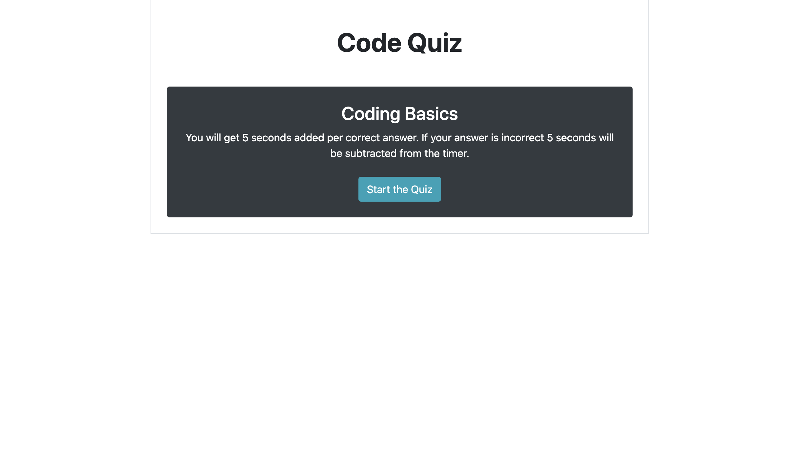

# Code Quiz

## Goals

### This webpage is designed to quiz a user on JavaScript fundamentals. It is intended to help gauge a user's progress on their understanding of JavaScript concepts and strengthen their memory retention.
## Application

#### Highlights
1. A 60 second timer starts upon starting the quiz.
2. For each correct answer, the timer gets an additional 5 seconds added with the caveat of a 60 second limit.
3. For each incorrect answer, the timer will have 5 seconds subtracted.
4. If the timer reaches zero, the player will end the quiz with their current score. 
5. Upon completion of the quiz, the user is able to save their high score and initials.
6. The player can access their high score page by clicking on a button that will link them to the high score page.
7. If the user would like to try again, they can access the quiz again on the high score page.
## Result

A timed quiz that checks whether an answer is correct or incorrect and responds with the appropriate functions.

[Link](https://olivelliott.github.io/code-quiz/index.html)

